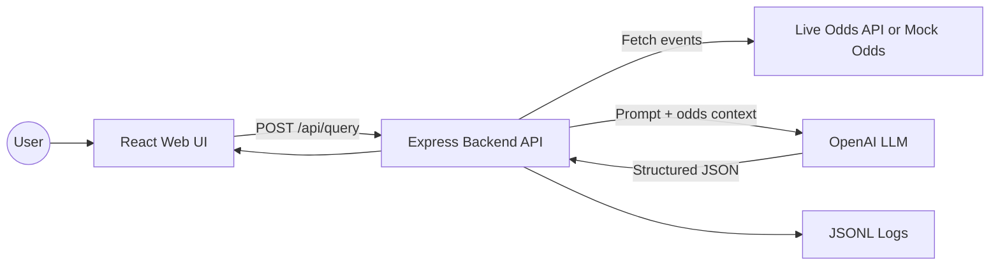

# Architecture

## Text-only flow

1. User enters a natural language question.
2. Frontend sends `POST /api/query`.
3. Backend fetches live odds if `ODDS_API_KEY` is present.
4. Backend falls back to `backend/data/mock_odds.json` if live odds are unavailable.
5. Backend sends user query, context, and odds data to the LLM.
6. LLM returns strict JSON.
7. UI renders recommendation, rationale, odds used, warnings, and responsible gambling notice.

## Extension points

- Add `/api/query-voice` for speech-to-text.
- Add more sports by changing `ODDS_SPORT_KEY`.
- Add safer deterministic pre-checks before the LLM call.
- Add persistent storage for logs.
